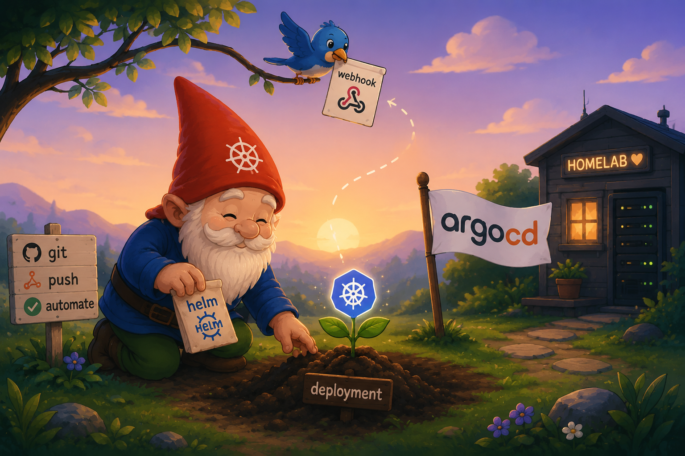
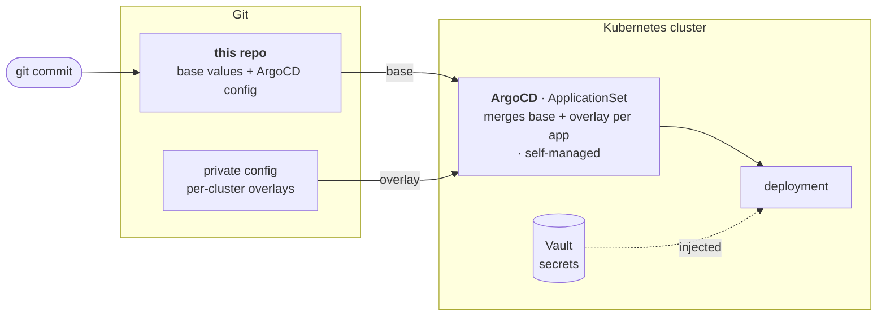

# Homelab Kubernetes Platform

<p align="center">
  
</p>

This repository holds the ArgoCD configuration and base Helm value files for my
homelab Kubernetes cluster. It is the source of truth for the deployment
pipeline: a commit here triggers the automation that reconciles the cluster to
match Git.



## Stack

| Area | Tools |
|------|-------|
| GitOps & delivery | **ArgoCD** — ApplicationSet auto-discovery, self-managing |
| Packaging | **Helm** — a shared base chart + per-cluster value overlays |
| Networking | **Cilium** (Gateway API), **Tailscale**, external-dns |
| Secrets | **HashiCorp Vault** + Vault Secrets Operator |
| Storage | **Longhorn**, SMB/CSI |
| Observability | **VictoriaMetrics**, **Grafana**, **Loki**, Alloy |
| Automation | **Renovate**, **GitHub Actions** |

## How it works

- Every app is a directory with a Helm chart and a small `deploy.yaml`.
- An ArgoCD **ApplicationSet** discovers each `deploy.yaml` and creates the
  Application automatically — add a directory, commit, and it deploys. No
  `kubectl apply`, no manifest wiring by hand.
- Charts follow a **base + overlay** model: generic defaults live here, and
  cluster-specific values are layered in at deploy time.
- ArgoCD is **bootstrapped once, then manages itself** from Git — upgrades,
  configuration, even full disaster recovery all flow through commits.

## What's running

~49 workloads, including:

- **Media** — Plex, Immich, Audiobookshelf, Paperless
- **Self-hosted AI** — Ollama, llama.cpp, ComfyUI, Open WebUI, an MCP gateway
- **Observability** — Grafana, VictoriaMetrics, Loki, a set of exporters
- **Home & network** — Frigate NVR, environmental & energy monitoring, Omada
- **Platform** — Vault, cert-manager, Cilium gateway, Longhorn, CI runners

## Repository layout

```
<app>/            # one directory per app — Chart.yaml, values.yaml, deploy.yaml, templates/
argocd/           # ArgoCD + the ApplicationSet that runs everything (self-managed)
simple-service/   # shared library chart most apps build on
hello-world/      # a minimal example — the easiest place to start reading
```

## License

[MIT](LICENSE) © 2026 thorix
