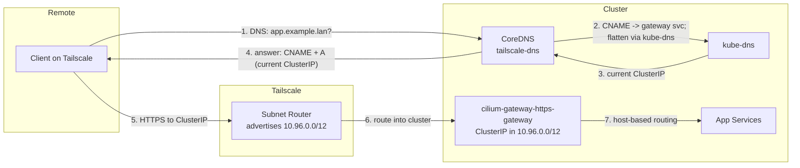

# Tailscale Split DNS (CoreDNS)

Dedicated CoreDNS instance that resolves `*.example.lan` to the https-gateway so
**remote Tailscale clients can reach cluster services** by the same hostnames they
use at home.

## Problem

Remote clients on Tailscale can reach the cluster **service CIDR** (`10.96.0.0/12`)
through the subnet router, but at home `*.example.lan` resolves (via the LAN
resolver, e.g. OPNsense) to the gateway's **LAN IP**, which is **not** reachable
over the tailnet. We deliberately do **not** advertise the LAN subnet over Tailscale
— that creates routing loops for machines already on the LAN. So remote clients need
a name → **in-cluster** address answer instead.

## Solution

This CoreDNS answers `*.example.lan` with a **CNAME to the gateway's cluster service
name**, which CoreDNS then flattens to the gateway's current **ClusterIP** (in the
`10.96.0.0/12` range the subnet router already advertises).



### Why a CNAME, not a hardcoded `A` record

The gateway's **ClusterIP changes** whenever the Gateway/LoadBalancer is recreated.
A hardcoded `A` record silently goes stale on the next recreation — remote access
breaks while home keeps working (home uses the LAN resolver, a different path), which
is confusing to diagnose.

The gateway's **service name is stable** — `cilium-gateway-<gateway-name>` is derived
from the Gateway object's name, which does not change. So the CNAME always points at
a valid name, and CoreDNS resolves it to *whatever the ClusterIP is today*. **This is
self-healing: no manual updates when the ClusterIP changes.**

> CoreDNS flattens the CNAME because the `.:53` block forwards `*.svc.cluster.local`
> to kube-dns, so the single response includes both the CNAME and the resolved `A`.

## Configuration

The Corefile and zone file are managed via the ConfigMap in `values.yaml` (real
zone + target in the private config overlay):

- **Wildcard zone:** `*.example.lan` → `CNAME cilium-gateway-https-gateway.<ns>.svc.cluster.local.`
- **Fallback:** all other queries forward to kube-dns (`10.96.0.10`)
- **Health:** HTTP health endpoint on port 8080

There is normally **nothing to update** when the gateway changes — the CNAME tracks
it. You only edit the zone if the **Gateway's name** or **namespace** changes (which
would change the service name), or if you switch ingress implementations.

## Post-Deploy Setup (one-time)

After ArgoCD syncs the application:

1. **Get the CoreDNS service ClusterIP:**
   ```bash
   kubectl get svc -n tailscale-dns
   ```
2. **Configure Tailscale split DNS** (admin console → DNS → Nameservers):
   - Add a **restricted** nameserver
   - Set it to the CoreDNS service ClusterIP from step 1
   - Restrict it to the domain: `example.lan`
3. Ensure the subnet router advertises `10.96.0.0/12` and the route is **approved**;
   on the client, enable **"Use subnet routes."**

## Verify

```bash
# From a Tailscale client — should return a CNAME plus an A in the 10.96.0.0/12 range:
nslookup app.example.lan <coredns-clusterip>

# Reachability + TLS:
curl -k https://app.example.lan        # should reach the app
```

## Troubleshooting

Remote `*.example.lan` fails ("network request failed") while home works:

1. **Confirm the CNAME flattens to the *current* ClusterIP:**
   ```bash
   kubectl get svc cilium-gateway-https-gateway -n <gateway-ns> -o jsonpath='{.spec.clusterIP}'
   nslookup app.example.lan <coredns-clusterip>   # A record must match the above
   ```
   If they differ, restart CoreDNS so it reloads the zone:
   `kubectl rollout restart deploy -n tailscale-dns`.
2. **Confirm the subnet route** (`10.96.0.0/12`) is advertised *and approved* in the
   Tailscale admin, and the client has "Use subnet routes" on.
3. **Confirm the gateway service name** still matches the CNAME target (it changes
   only if the Gateway's name/namespace changed).
